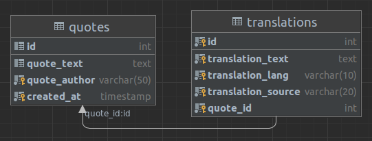

# Proiect : 24.Quote Manager integrat cu google translate api

## I. Backend (NodeJS)
---
1. Detalii
    - biblioteci: _ExpressJS, Sequelize (ORM), mariaDB, Google Translate API_
    - entitati: _Quote, Translate_

    

    - doua controllere (quote - _CRUD_, translation - _Google Translate API_), ce permit salvarea de citate si traducerea acestora din/in mai multe limbi, printre care si limba romana, utilizand Google Translate
    - la salvarea unui citat, este posibila adaugarea unei traduceri optional
    - se pot adauga traduceri dupa salvarea unui citat
    - se pot sterge atat citate cat si traduceri
    - se pot modifica citatele
    - se listeaza citatele cu traducerile aferente
2. Rulare
    - instalare _NodeJS_
    - instalare biblioteci: ```npm install```
    - modificare fisier `src/config/db.config.js` pentru conectarea la baza de date HeidiSQL
    - rulare server: ```npm start```
    - accesare RESTful: http://localhost:8080
    - rute

        | Actiune       | Metoda       | Ruta                          | Parametrii|
        | ------------- |:-------------| :-----------------------------| ---|
        | salvare citat | POST         | `/api/quotes`                 | JSON: quote, author, translations [translationText, translationLang, translationSource] |
        | adaugare traducere | POST         | `/api/quotes/add-translation` | JSON: translationText, translationLang, translationSource, quoteId |
        | listare citate | GET          | `/api/quotes`                 ||
        | afisare citat | GET          | `/api/quotes/:id`             ||
        | actualizare citat | PUT          | `/api/quotes/:id`             | JSON: quote, author|
        | stergere citat | DELETE       | `/api/quotes/:id`             ||
        | stergere traducere | DELETE       | `/api/quotes/translation/:id` ||
        | stergere citate | DELETE       | `/api/quotes`                 ||
        | traducere text | POST         | `/api/translate`              | JSON: text, lang |
        | listare limbi suportate | GET          | `/api/translate/langs`        |
 
 

## II. Frontend (ReactJS)

<hr>

**Dragomir Denis-Alexandru**: Am verificat partea de backend. Nu ai prezentat cazurile in care rutele puteau genera eroare. Foarte bine, in rest.

Punctaj - backend: **1,3 / 1,5**

Punctaj - frontend: **TBD**

Punctaj total (pentru zonele necompletate, pana la evaluare, se ia in considerare punctajul maxim): **4,8 / 4**

## Am incarcat in sectiunea " Branches/master" proiectul complet
## **Toate instructiunile pt a rula le gasiti in "README(partea2)" atat in tag ul master cat si in main

